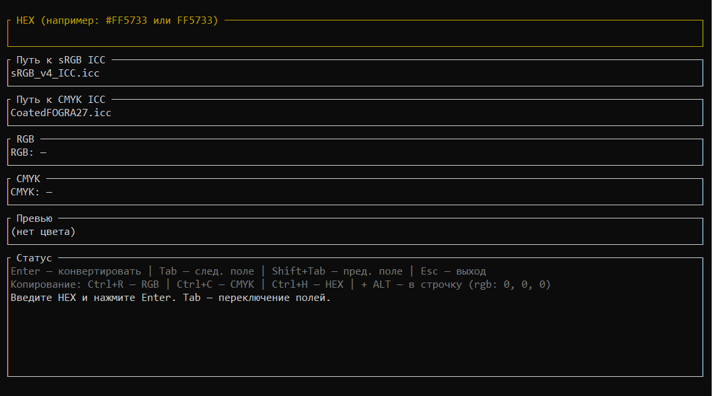

# Конвертер цветов

---

**color converter** - приложение, которое позволяет удобно конвертировать и форматировать коды цветов из `HEX` в `RGB` и `CMYK` форматы

---

## Установка и запуск приложения

1. Перейти на [страницу](https://github.com/qvortex-beem/color_converter) проекта
2. В столбике справа найти **Releases** и щелкнуть
3. Выбрать самую последнюю версию и установить архив с программой из **Assets**
4. Распаковать архив в удобное место на компьютере
5. Двойным щелчком открыть файл `color_converter.exe`
6. Следовать дальнейшим инструкциям из приложения

---

## Управление и настройка

После запуска приложения вы увидите подобный интерфейс:

1. Первое поле показывает введенный вами hex-цвет, его можно вводить вручную, набирая его на клавиатуре, либо использовать `ctrl+v` на клавиатуре, для вставки кода из буфера обмена

**допустимые значения:**
   - `fff` / `#fff`
   - `ffffff` / `#ffffff`
   - `FFF` / `#FFF`
   - `FFFFFF` / `#FFFFFF`

**примеры допустимого содержимого буфера обмена для быстрой вставки:**
   - `набор символов #fefefe набор символов` (подставится #fefefe)
   - `fefefe` (подставится fefefe)

2. второе и третье поля указывают путь до icc-профилей. Их можно сменить, если вы используете другие, но лучше положить новый профиль в папку рядом с .exe файлом и переименовать его одним из названий, указанных в этих полях

3. поля RGB и CMYK показывают какие значения были получены после конвертации

4. поле превью отображает цвет кода, который вы конвертировали

5. поле статус отображает сообщения ошибок, памятку по управлению и системные логи об успешном выполнении операции

**Управление**

- enter - конвертировать
- tab / shift+tab перемещение между полями
- ctrl+v - быстрая вставка цвета из буфера обмена
- `ctrl+r` - копирует rgb-код в столбик
- `ctrl+c` - копирует cmyk-код в столбик
- alt, совместно с `комбинациями` меняет форматирование в столбик на форматирование в строчку
- ctrl+h - копирует содержимое поля для ввода hex-цвета
- esc - закрытие приложения

---

## Обратная связь

Если вы столкнетесь с трудностями, обнаружите баг в программе или у вас появится предложение по улучшению приложения вы можете связаться со мной:

- по почте: ghujfeuhh1@gmail.com
- [через телеграм](https://t.me/rainnersarkozofonrihter)

---
